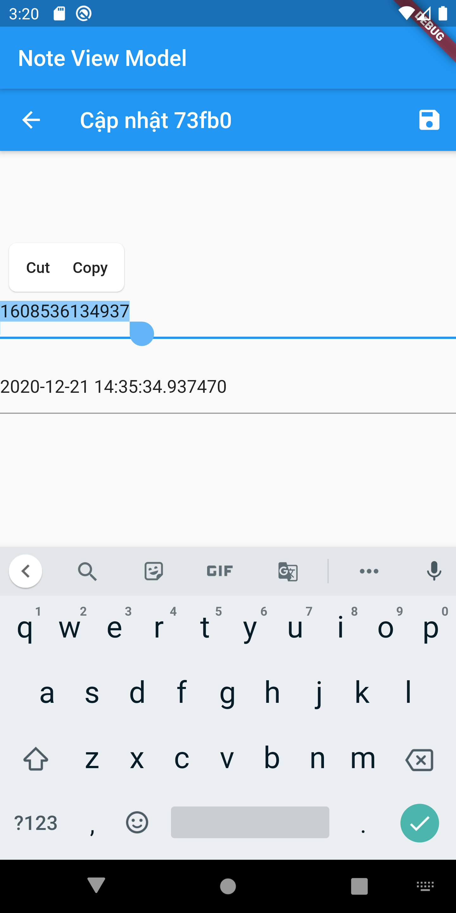

# note_app

## Bài thực hành chương 4: Xây dựng các chức năng, hiển thị listview, thêm, sửa, xoá, xem chi tiết của ứng dụng Note

### Descript quá trình xây dựng ứng dụng Note

1. Tạo giao diện hiển thị listview note.
1. Tạo chức năng thêm ghi chú.
1. Tạo chức năng sửa(update) ghi chú.
1. Tạo chức năng xoá ghi chú.
1. Tạo chức năng xem chi tiết(detail) ghi chú.

### Mã nguồn **note_view.dart** : Hiển thị danh sách ghi chú

```
import 'package:flutter/material.dart';
import 'package:mynote/ui/views/note/widgets/note_view_item.dart';
import 'package:mynote/ui/views/note/widgets/note_view_item_edit.dart';
import 'package:stacked/stacked.dart';

import 'note_viewmodel.dart';
import 'note_model.dart';

class NoteView extends StatelessWidget {
  @override
  Widget build(BuildContext context) {
    return ViewModelBuilder<NoteViewModel>.reactive(
      onModelReady: (model) => model.init(),
      builder: (context, model, child) => Scaffold(
        appBar: AppBar(title: Text(model.title)),
        body: Stack(
          children: [
            model.state == NoteViewState.listView
                ? ListView.builder(
                    itemCount: model.items.length,
                    itemBuilder: (BuildContext context, int index) {
                      Note item = model.items[index];
                      return ListTile(
                        title: Text(item.title),
                        subtitle: Text(item.desc),
                        onTap: () {
                          model.editingItem = item;
                          model.state = NoteViewState.itemView;
                        },
                      );
                    },
                  )
                : model.state == NoteViewState.itemView
                    ? NoteViewItem()
                    : model.state == NoteViewState.updateView
                        ? NoteViewItemEdit()
                        : SizedBox(),
          ],
        ),
        floatingActionButton: model.state == NoteViewState.listView
            ? FloatingActionButton(
                child: Icon(Icons.add),
                onPressed: () {
                  model.addItem();
                },
              )
            : null,
      ),
      viewModelBuilder: () => NoteViewModel(),
    );
  }
}
```

- Result note_view.dart:


### Mã nguồn **note_viewmodel.dart** : Chức năng thêm ghi chú (ngày 21/12/2020)

```
import 'package:flutter/material.dart';
import 'package:mynote/ui/views/note/note_repository.dart';
import 'package:stacked/stacked.dart';

import 'note_model.dart';

/// Trạng thái của view
enum NoteViewState { listView, itemView, insertView, updateView }

class NoteViewModel extends BaseViewModel {
  final title = 'Note View Model';

  /// Danh sách các bản ghi được load bất đồng bộ bên trong view model,
  /// khi load thành công thì thông báo đến view để cập nhật trạng thái
  var _items = <Note>[];

  /// ### Danh sách các bản ghi dùng để hiển thị trên ListView
  /// Vì quá trình load items là bất đồng bộ nên phải tạo một getter
  /// `get items => _items` để tránh xung đột
  List<Note> get items => _items;

  /// Trạng thái mặc định của view là listView, nó có thể thay đổi
  /// bên trong view model
  var _state = NoteViewState.listView;

  /// Khi thay đổi trạng thái thì sẽ báo cho view biết để cập nhật
  /// nên cần tạo một setter để vừa nhận giá trị vừa thông báo đến view
  set state(value) {
    // Cập nhật giá trị cho biến _state
    _state = value;

    // Thông báo cho view biết để cập nhật trạng thái của widget
    notifyListeners();
  }

  /// Cần có một getter để lấy ra trạng thái view cục bộ cho view
  NoteViewState get state => _state;

  Note editingItem;

  var editingControllerTitle = TextEditingController();
  var editingControllerDesc = TextEditingController();

  ///
  var repo = NoteRepository();

  Future init() async {
    return reloadItems();
  }

  Future reloadItems() async {
    return repo.items().then((value) {
      _items = value;
      notifyListeners();
    });
  }

  void addItem() {
    var timestamp = DateTime.now();
    var title = timestamp.millisecondsSinceEpoch.toString();
    var desc = timestamp.toLocal().toString();

    var item = Note(title, desc);
    repo.insert(item).then((value) {
      reloadItems();
    });
  }

  void updateItem() {
    editingControllerTitle.text = editingItem.title;
    editingControllerDesc.text = editingItem.desc;
    state = NoteViewState.updateView;
  }

  void saveItem() {
    // TODO lưu editingItem

    // TODO editingItem = null
    editingItem = null;
    notifyListeners();
  }
}
```

- Result note_viewmodel.dart:


### Mã nguồn **note_view_item_edit.dart:** : Chức năng sửa ghi chú

```
import 'package:flutter/material.dart';
import 'package:mynote/ui/views/note/note_model.dart';
import 'package:mynote/ui/views/note/note_viewmodel.dart';
import 'package:stacked/stacked.dart';

class NoteViewItemEdit extends ViewModelWidget<NoteViewModel> {
  final _formKey = GlobalKey<FormState>();

  @override
  Widget build(BuildContext context, model) {
    return Scaffold(
      appBar: AppBar(
        title: Text('Cập nhật ${model.editingItem.id}'),
        leading: IconButton(
          icon: Icon(Icons.arrow_back),
          onPressed: () => model.state = NoteViewState.listView,
        ),
        actions: [
          IconButton(
            icon: Icon(Icons.save),
            onPressed: () => model.saveItem(),
          )
        ],
      ),
      body: Form(
          key: _formKey,
          child: Column(
            crossAxisAlignment: CrossAxisAlignment.start,
            mainAxisAlignment: MainAxisAlignment.center,
            children: [
              TextFormField(
                  decoration: InputDecoration(
                    hintText: 'Nhập tiêu đề',
                  ),
                  controller: model.editingControllerTitle),
              SizedBox(height: 20),
              TextFormField(
                decoration: InputDecoration(
                  hintText: 'Nhập mô tả',
                ),
                controller: model.editingControllerDesc,
              )
            ],
          )),
    );
  }
}
```

- Result note_view_item_edit.dart:



### Mã nguồn **note_view_item.dart:** : Chức năng xem chi tiết ghi chú

```
import 'package:flutter/material.dart';
import 'package:mynote/ui/views/note/note_model.dart';
import 'package:mynote/ui/views/note/note_viewmodel.dart';
import 'package:stacked/stacked.dart';

class NoteViewItem extends ViewModelWidget<NoteViewModel> {
  @override
  Widget build(BuildContext context, model) {
    return Scaffold(
      appBar: AppBar(
        title: Text('Chi tiết ${model.editingItem.id}'),
        leading: IconButton(
          icon: Icon(Icons.arrow_back),
          onPressed: () => model.state = NoteViewState.listView,
        ),
        actions: [
          IconButton(
              icon: Icon(Icons.edit),
              onPressed: () => model.updateItem())
        ],
      ),
      body: Center(
        child: ListTile(
          title: Text(model.editingItem.title),
          subtitle: Text(model.editingItem.desc),
        ),
      ),
    );
  }
}
```

- Result note_view_item.dart:


